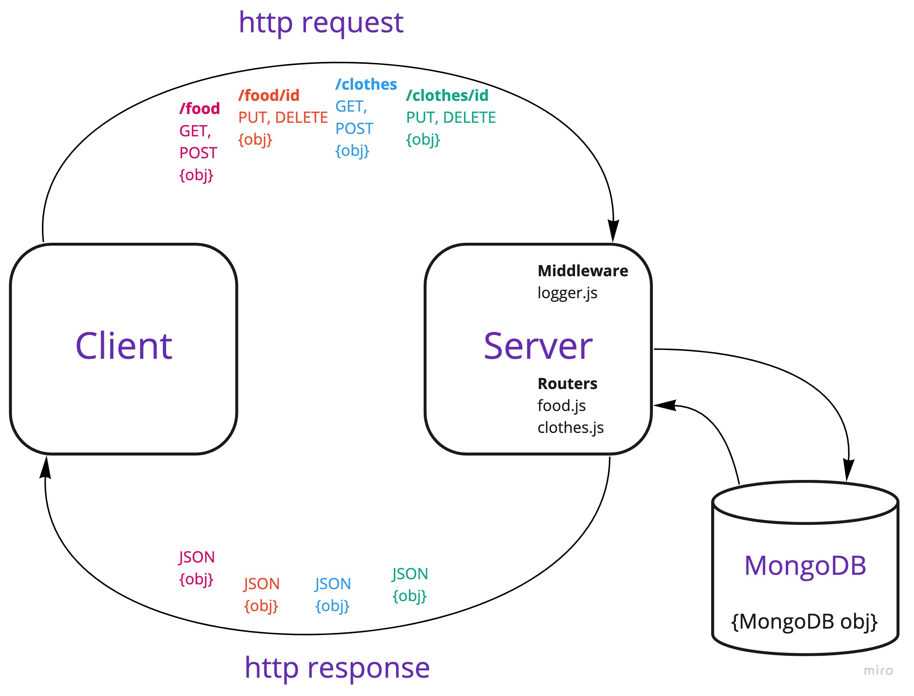

# LAB - Class 04

## Project: API Server

### Author: Brendan Smith

### Links and Resources

- [ci/cd](https://github.com/brendigler/api-server/actions)
- [server url](https://brsmith-api-server.herokuapp.com/)
- [Pull Request]()

### Setup

#### `.env` requirements

- `PORT` - Port Number
- `MONGODB_URI` - MongoDB URI

#### How to initialize/run your application

- clone to local repo
- `npm install`
- `npm start`

#### Tests

- Run tests with `npm test`

#### UML / Application Wiring Diagram

